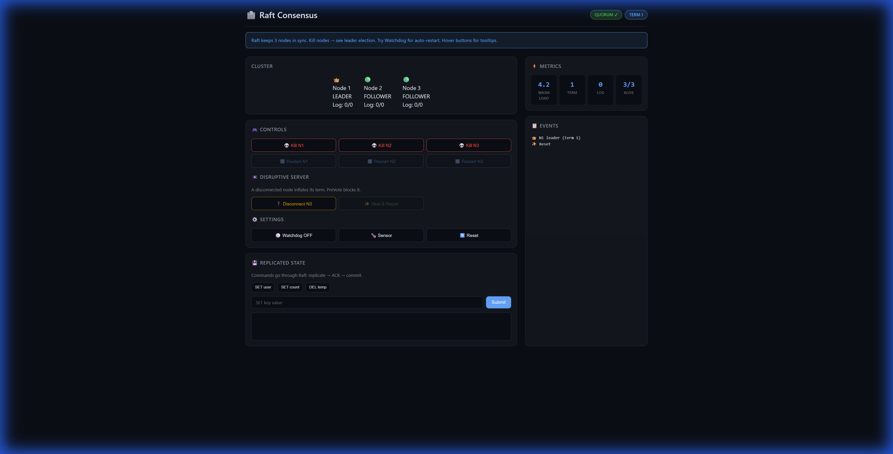
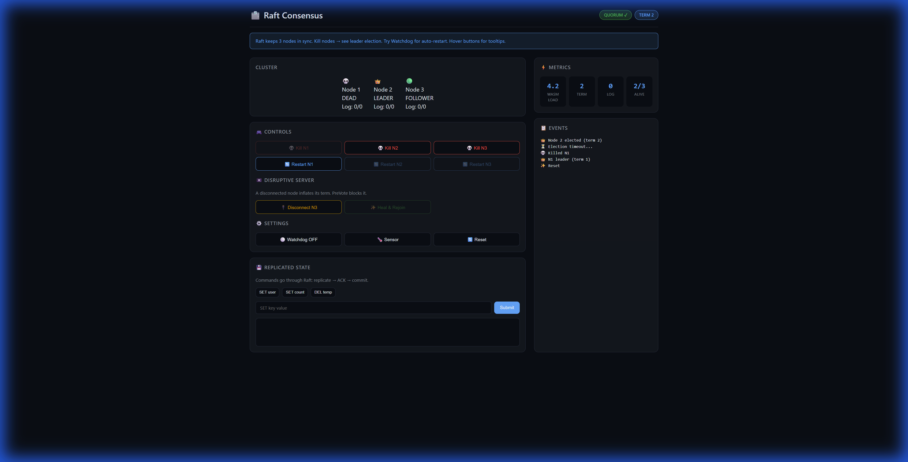
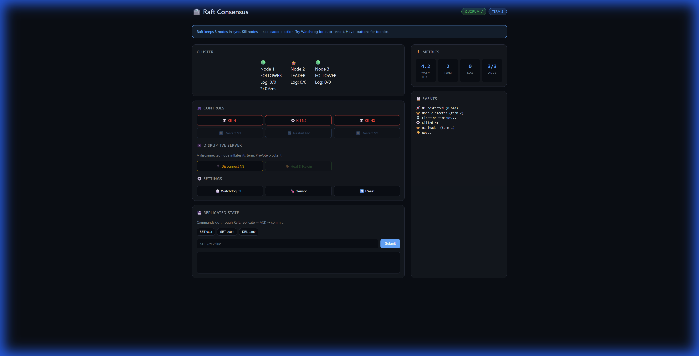
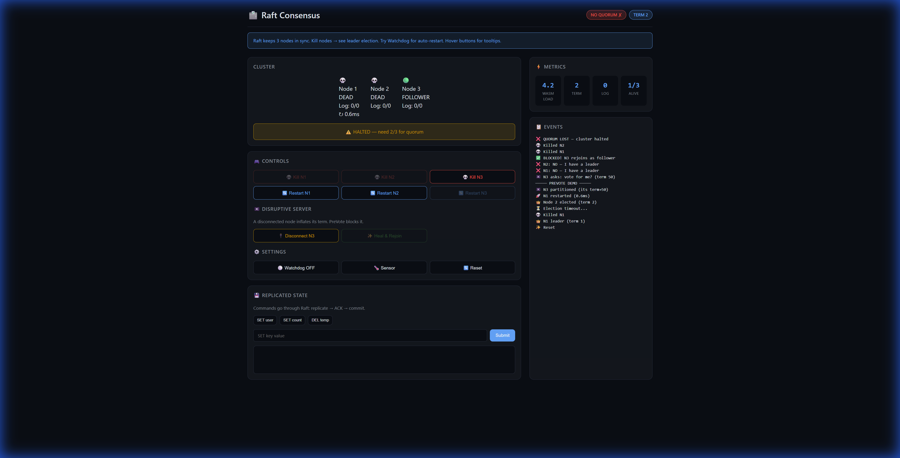
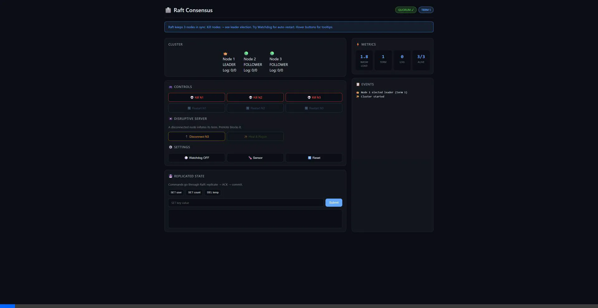

<p align="center">
  
  
  
  
  
</p>

<h1 align="center">🗳️ Raft Consensus Cluster</h1>

<p align="center">
  <strong>"Unsinkable" Distributed Consensus via WASI 0.2<br/>
  Same binary runs in browser AND on Raspberry Pi cluster.</strong>
</p>

<p align="center">
  
  
  <a href="https://raft-consensus-kappa.vercel.app"></a>
  
  
  
</p>

<p align="center">
  
</p>

---

## 📑 Contents

- [The Scenario](#-the-scenario-distributed-control-plane) — What problem this solves
- [Architecture](#️-architecture) — How it's built
- [Why WASI + WASM?](#-why-wasi--wasm) — Size and portability advantages
- [Project Structure](#-project-structure) — File organization
- [Quick Start](#-quick-start) — Run it locally
- [Key-Value Store Demo](#-key-value-store-demo) — Interactive commands
- [Chaos Controls](#-chaos-controls) — Fault injection scenarios
- [Testing](#-testing) — Verification
- [Hardware Demo](#-hardware-demo-coming-soon) — Raspberry Pi cluster
- [Portfolio Context](#-portfolio-context) — Reliability Triad
- [License](#-license)

---

## 🎯 The Scenario: Distributed Control Plane

> *"Three edge devices need to maintain consistent configuration state, even when 
> network partitions occur or individual nodes crash. Raft consensus ensures the 
> cluster agrees on every state change — or safely halts until quorum is restored."*

```
┌─────────────────────────────────────────────────────────────────────────────┐
│                       RAFT CONSENSUS CLUSTER                                │
├─────────────────────────────────────────────────────────────────────────────┤
│                                                                             │
│         ┌─────────┐      ┌─────────┐      ┌─────────┐                      │
│         │  NODE 1 │◄────►│  NODE 2 │◄────►│  NODE 3 │                      │
│         │   🔵    │      │   🟢    │      │   🟢    │                      │
│         │ LEADER  │      │FOLLOWER │      │FOLLOWER │                      │
│         │ Log: 47 │      │ Log: 47 │      │ Log: 47 │                      │
│         └─────────┘      └─────────┘      └─────────┘                      │
│                                                                             │
│   Demo: Kill Node 3 → Cluster continues (2/3 quorum)                       │
│   Demo: Kill Node 2 → Cluster halts (1/3 = no majority) — SAFETY!          │
│   Demo: Restart → Auto-sync missed entries                                  │
└─────────────────────────────────────────────────────────────────────────────┘
```

## 🏗️ Architecture

| Component | Technology | Purpose |
|-----------|------------|---------|
| **raft-core** | Pure Rust | State machine, elections, log replication |
| **raft-storage** | Rust + std::fs | Persistence trait (IndexedDB in browser) |
| **raft-wasm** | wit-bindgen + WASI 0.2 | Component model exports (same binary: browser + Pi) |
| **wit/** | WIT Interface | Contract between WASM component and host |
| **shim/** | JavaScript + jco | WASI polyfills: BroadcastChannel, IndexedDB |
| **dashboard/** | Leptos + Trunk | Security console UI with chaos controls |

```
┌─────────────────────────────────────────────────────────────────┐
│                     Browser Runtime                              │
├─────────────────────────────────────────────────────────────────┤
│  Leptos Dashboard (cluster viz, KV store, event log)            │
├─────────────────────────────────────────────────────────────────┤
│  JavaScript Host Shim                                            │
│  ┌──────────────────┐  ┌──────────────────┐                     │
│  │  BroadcastChannel │  │    IndexedDB     │                     │
│  │  (Virtual Network)│  │  (Virtual FS)    │                     │
│  └──────────────────┘  └──────────────────┘                     │
├─────────────────────────────────────────────────────────────────┤
│  WASM Nodes (x3) — same raft.wasm as hardware demo              │
│  ┌─────────┐ ┌─────────┐ ┌─────────┐                            │
│  │raft-core│ │raft-    │ │raft-wasm│                            │
│  │         │ │storage  │ │(exports)│                            │
│  └─────────┘ └─────────┘ └─────────┘                            │
└─────────────────────────────────────────────────────────────────┘
```

📖 **[Read full architecture doc →](docs/ARCHITECTURE.md)**

## 📡 Why WASI + WASM?

| Challenge | Traditional | This Project |
|-----------|-------------|--------------|
| **OTA Updates** | 50-200 MB containers | ~500 KB WASM |
| **Satellite/offshore** | Minutes to transfer | Seconds |
| **Runtime deps** | Python/Node/Docker | Single `.wasm` file |
| **Crash isolation** | OS processes | WASM sandbox |
| **Portability** | Build per platform | Same binary everywhere |

> 🛰️ **For offshore rigs with 256 Kbps satellite:** WASM update takes 15 seconds vs Docker's 78 minutes.

## 📁 Project Structure

```
raft-consensus/
├── crates/
│   ├── raft-core/          # pure raft algorithm logic
│   │   └── src/
│   │       ├── lib.rs      # crate exports
│   │       ├── node.rs     # state machine, election logic
│   │       ├── message.rs  # rpc types: VoteRequest, AppendEntries
│   │       └── log.rs      # replicated log management
│   │
│   ├── raft-storage/       # persistence abstraction
│   │   └── src/lib.rs      # Storage trait, FileStorage impl
│   │
│   └── raft-wasm/          # WASI 0.2 component exports
│       └── src/lib.rs      # wit-bindgen implementation
│
├── wit/
│   └── raft.wit            # component interface definition
│
├── shim/                   # javascript wasi polyfills
│   ├── host.js             # WasiHost: instantiates wasm nodes
│   ├── network.js          # BroadcastChannel virtual network
│   ├── filesystem.js       # IndexedDB virtual filesystem
│   ├── raft-bridge.js      # High-level WASI component wrapper
│   └── wasm/               # jco transpiled component (raft.js)
│
├── dashboard/              # leptos web ui
│   ├── src/lib.rs          # cluster viz, kv store, event log
│   └── styles.css          # security console dark theme
│
└── docs/
    ├── ARCHITECTURE.md     # system design rationale
    ├── RAFT_SPEC.md        # algorithm details
    ├── WASI_MAPPING.md     # std → browser api mapping
    └── HARDWARE_SETUP.md   # raspberry pi cluster guide
```

## 🚀 Quick Start

```powershell
# install trunk (build tool for leptos)
cargo install trunk

# install javascript dependencies
npm install

# run dev server with live reload
cd dashboard
trunk serve
# opens http://localhost:8080
```

**Run tests (120 total):**
```powershell
# Run all tests
cargo test --workspace

# Comprehensive tests
cargo test -p raft-core --test comprehensive_tests    # 84 tests
cargo test -p raft-storage --test comprehensive_tests # 36 tests
```

## 💾 Key-Value Store Demo

The dashboard includes an interactive key-value store to demonstrate log replication:

```
> SET temperature 72.5
✓ Committed (2/3 acks) @ index 48

> GET temperature
→ 72.5

> [Kill leader node]
> SET pressure 14.7
⏳ Pending... (election in progress)
✓ Committed (new leader elected)
```

| State | Display |
|-------|---------|
| Pending | ⏳ `Pending... (awaiting quorum)` |
| Committed | ✓ `Committed (2/3 acks) @ index 48` |
| Failed | ✗ `Failed: no quorum (only 1/3 alive)` |

## 🎮 Chaos Controls

| Control | What Happens | Demo Value |
|---------|--------------|------------|
| **Kill Node** | Node stops responding | Basic fault tolerance |
| **Kill Leader** | Triggers new election | Leader failover |
| **Network Partition** | Isolate node(s) | Split-brain safety |
| **Slow Network** | 500ms latency | Election timeout behavior |
| **Rogue Node** | Disconnected node with high term | **PreVote protection** ✨ |
| **Restart All** | Recover cluster | Auto-sync verification |

### ✨ PreVote Protocol Demo

The "Rogue Node" demo showcases our **PreVote** implementation (Raft Thesis Section 9.6):

```
Scenario: Node 3 gets disconnected for a while
─────────────────────────────────────────────────────────────────
Without PreVote:                    │ With PreVote (our impl):
                                    │
Node 3 keeps timing out,            │ Node 3 times out but only
incrementing term to 50.            │ sends "would you vote for me?"
                                    │
When reconnected, Node 3's          │ Other nodes reply "NO — we
high term forces leader to          │ have a healthy leader."
STEP DOWN immediately!              │
                                    │ Node 3's term stays unchanged.
❌ Cluster disrupted for no         │ ✅ Cluster stays stable!
   good reason                      │
```

**The "wow" moment:** Partition the cluster 1 vs 2 — the minority halts while majority continues. This is Byzantine fault safety in action.

<details>
<summary><h3>📸 View Demo Scenario Screenshots</h3></summary>

#### Leader Failover
<p align="center">
  
</p>

**What's happening:** Node 1 (leader) was killed. Node 2 won the election and became the new leader in Term 2. Cluster continues with 2/3 quorum.

---

#### Node Recovery & Log Sync
<p align="center">
  
</p>

**What's happening:** Node 1 restarted and automatically rejoined as a follower. Its log will sync with the current leader.

---

#### Rogue Node (Network Partition)
<p align="center">
  
</p>

**What's happening:** Node 3 was partitioned. In isolation, it times out repeatedly, inflating its term to 50. The cluster (N1 + N2) continues unaffected.

---

#### PreVote Blocking
<p align="center">
  
</p>

**What's happening:** When N3 tries to rejoin, it asks "Would you vote for me at term 50?" The other nodes say "NO — we have a healthy leader." N3 cannot disrupt the cluster.

---

#### Quorum Loss (Safety Halt)
<p align="center">
  
</p>

**What's happening:** With 2/3 nodes dead, the cluster cannot reach majority. It **halts safely** rather than accepting writes that might violate consistency. This is the Raft safety guarantee in action.

---

#### Log Resync Demo (Animated)
<p align="center">
  
</p>

**What's happening:** Node 3 was partitioned while 20 sensor readings were added. When healed, N3 syncs all 20 entries instantly — showing Raft's automatic log reconciliation.

</details>

## 🧪 Testing

**120 comprehensive tests** covering all Raft scenarios:

```powershell
# Run all tests
cargo test --workspace

# Individual test suites
cargo test -p raft-core --test comprehensive_tests    # 84 tests: elections, voting, replication
cargo test -p raft-storage --test comprehensive_tests # 36 tests: persistence, crash recovery
```

| Test Category | Count | Coverage |
|---------------|-------|----------|
| Initialization | 4 | Node startup, cluster membership |
| Quorum | 6 | 3/5/7 node clusters, majority voting |
| Elections | 10 | Timeout, vote counting, term handling |
| Vote Requests | 9 | Grant/reject logic, log comparison |
| Leader State | 4 | next_index, match_index |
| AppendEntries | 12 | Log replication, consistency checks |
| PreVote | 11 | Disruptive server prevention |
| Commit | 8 | Quorum-based commit, safety |
| Crash Recovery | 20+ | State persistence, log replay |

## 🍓 Hardware Demo (Coming Soon)

The same `raft.wasm` binary will run on a real 3-node Raspberry Pi cluster:

| Hardware | Model | Role |
|----------|-------|------|
| **Primary** | Raspberry Pi 4 (4GB) | Usually leader |
| **Follower** | Pi Zero 2 W | Node 2 |
| **Follower** | Pi Zero 2 W | Node 3 |

**Visual feedback:**
| LED Color | Meaning |
|:---------:|---------|
| 🔵 Blue | Leader |
| 🟢 Green | Follower (healthy) |
| 🟡 Yellow | Candidate (election) |
| 🔴 Red | Offline |

**What stays the same:**
- `raft.wasm` — identical binary, zero changes
- Raft algorithm — same election, replication, quorum logic
- Storage trait — real filesystem instead of IndexedDB

📖 **[Full hardware setup guide →](docs/HARDWARE_SETUP.md)**

> 🎬 Demo video coming soon — split-screen browser + physical Pi cluster.

## 🔗 Portfolio Context

This project is part of a **Reliability Triad** demonstrating industrial-grade systems engineering:

| Project | Reliability Story | Demo |
|---------|-------------------|------|
| [ICS Guardian](https://github.com/gammahazard/vanguard-ics-guardian) | Capability-based isolation | [Live Demo](https://vanguard-ics-guardian.vercel.app) |
| [Protocol Gateway](https://github.com/gammahazard/protocol-gateway-sandbox) | 2oo3 TMR crash recovery | [Live Demo](https://protocol-gateway-sandbox.vercel.app) |
| **Raft Cluster** (this) | Distributed consensus | [Live Demo](https://raft-consensus.vercel.app) |
| [Guardian-One](https://github.com/gammahazard/guardian-one) | **Hardware implementation** | *Private - in development* |

> **Guardian-One** is the hardware implementation of these concepts — a Rust/Wasmtime host running on Raspberry Pi 4 with BME280 sensors, SainSmart relays, and a 3-node Raft cluster for fault tolerance. Hardware demo coming soon.
>
> **Note:** This Raft implementation is a learning demonstration. For production deployments, Guardian-One will integrate an industry-standard Raft library like `openraft` or `raft-rs`.

## 🌿 Branch Strategy

| Branch | Purpose | Deployment |
|--------|---------|------------|
| `main` | Stable releases | Production |
| `develop` | Integration | Preview |
| `feature/*` | Feature work | — |

## 📚 Documentation

- [**Architecture Deep Dive**](docs/ARCHITECTURE.md) — System design, component responsibilities, data flow
- [**Raft Specification**](docs/RAFT_SPEC.md) — PreVote protocol, elections, log replication, safety guarantees
- [**WASI Mapping**](docs/WASI_MAPPING.md) — How std::fs and std::net map to browser APIs
- [**Hardware Setup**](docs/HARDWARE_SETUP.md) — Raspberry Pi cluster guide (coming soon)

## 📜 License

MIT © 2026

---

<p align="center">
  <em>Built to demonstrate distributed consensus for industrial control systems.</em>
</p>
